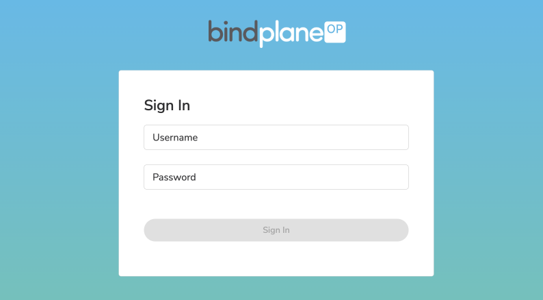

# client

BindPlane OP has several client options
  - [Web Interface](#web-interface)
  - [BindPlane CLI](#bindplane-cli)
  - [REST API](#rest-api)
  - [Go Client](#go-client)

## Web Interface

Using a web browser, the BindPlane OP web interface is available. Simply connect to the BindPlane IP address and port. By default, the port is `3001`. The interface is secured with basic authentication. Enter the username and password configured when setting up the BindPlane server.

The web interface is intended to be fully featured. Users can install agents and manage configurations.



## BindPlane CLI

BindPlane OP provides a cli, `bindplanectl`. See the [client install doc](./install.md#client) for installation details.

Documented in this section are several usage examples. Use the `help` command or `--help` flag for detailed output for all available commands and flags.

**Install Agent**

Generate an agent installation command using the `install agent` command.

```bash
bindplane install agent --platform linux
```
```bash
sudo sh -c "$(curl -fsSlL https://github.com/observiq/observiq-otel-collector/releases/latest/download/install_unix.sh)" install_unix.sh -e wss://bindplane.mydomain.net:3001/v1/opamp -s 000000-0000-0000-0000-000000
```

**Manage Agents**

Agents can be listed with the `get agents` command

```bash
bindplanectl get agent
```
```
ID                                  	NAME       	VERSION	STATUS      	CONNECTED 	DISCONNECTED	LABELS
ecbfee94-b0d7-4d0c-9a7c-8bc29d537fa7	fedora     	v1.3.0 	Disconnected	-         	6h19m11s    	configuration=otlp
9c82172d-8452-49f8-8558-7954ffc53fe6	iis     	v1.3.0 	Connected   	165h35m55s	-           	configuration=iis
3efd687e-0caf-4757-b0cc-16f65d2f45b4	dev-mbp	    v1.3.0 	Connected   	165h35m54s	-           	configuration=macos
e224f18f-a394-41d3-9767-1f8f423ecbeb	demo	    v1.3.0 	Connected   	24h53m42s 	-           	configuration=demo
```

You can get detailed information about a specific agent with the `output` flag

```bash
bindplanectl get agent ecbfee94-b0d7-4d0c-9a7c-8bc29d537fa7 -o yaml
```
```yaml
id: ecbfee94-b0d7-4d0c-9a7c-8bc29d537fa7
name: fedora
type: com.observiq.collector
arch: amd64
hostname: fedora
labels:
    bindplane/agent-arch: amd64
    bindplane/agent-host: fedora
    bindplane/agent-id: ecbfee94-b0d7-4d0c-9a7c-8bc29d537fa7
    bindplane/agent-name: fedora
    bindplane/agent-os: linux
    bindplane/agent-version: v1.3.0
    configuration: otlp
version: v1.3.0
home: ""
platform: linux
operatingSystem: Fedora 35
macAddress: unknown
remoteAddress: 69.176.133.154:6332
...
```

**Apply Configuration to Agent**

You apply a configuration to an agent by setting the `configuration` label.

```bash
bindplanectl label agent 3efd687e-0caf-4757-b0cc-16f65d2f45b4 configuration=otlp --overwrite
```

The `configuration` label determines which configuration is bound to the agent.

**Modify a Configurations**

Download a configuration with the `get config <config name> -o yaml` command

```bash
bindplanectl get config host -o yaml > host.yaml
```

Modify `host.yaml` and then apply the config

```bash
bindplanectl apply -f host.yaml
```
```
Configuration host configured
```

**Backup Destinations and Configurations**

You can backup all of your destinations and configurations easily

```bash
bindplanectl get destination -o yaml > destinations.yaml
bindplanectl get config -o yaml > config.yaml
```

These resources can be restored to a BindPlane instance with

```bash
bindplanectl apply -f destinations.yaml
```
```
Destination aggregator unchanged
Destination iris-demo-344318 unchanged
Destination platformX unchanged
Destination prom unchanged
```
```bash
bindplanectl apply -f config.yaml
```
```
Configuration aggregator unchanged
Configuration demo unchanged
Configuration host unchanged
Configuration iis unchanged
Configuration macOS unchanged
Configuration mongodb unchanged
Configuration production-host unchanged
```

This method makes it easy to save resources to git, ***just be sure*** that
your configurations do not contain sensitive values inappropriate for git.

## REST API

Under the hood, the web interface and cli are using HTTP requests to interact with the server. This means cURL or any other HTTP client
can be used.

API documentation can be found by starting a server and browsing `/swagger/index.html`.

Basic auth can be used for authentication, and `jq` for parsing the response.

```bash
curl -v -u admin:admin http://localhost:3001/v1/agents | jq .
```

## Go Client

BindPlane OP has a `client` package used by `bindplanectl` for interacting with
the REST API. This client can be consumed by custom tooling.

See the [Go docs](https://pkg.go.dev/github.com/observiq/bindplane-op/client) for available
client methods.

A simple application can be built by importing the bindplane-op packages and using the following code. (This example is not production ready, but can serve as a quick reference for configuring a client)

```go
package main

import (
	"context"
	"fmt"

	"github.com/observiq/bindplane-op/client"
	"github.com/observiq/bindplane-op/common"
	"go.uber.org/zap"
)

func main() {
	config := &common.Client{
		Common: common.Common{
			ServerURL: "http://localhost:3001",
			Username:  "admin",
			Password:  "admin",
		},
	}

	client, err := client.NewBindPlane(config, zap.NewNop())
	if err != nil {
		panic(err)
	}

	agents, err := client.Agents(context.Background())
	if err != nil {
		fmt.Println(err)
		return
	}

	for _, a := range agents {
		id := a.ID
		hostname := a.HostName
		configuration, ok := a.Labels.AsMap()["configuration"]
		if !ok {
			configuration = ""
		}
		fmt.Printf("%s %s configuration='%s'\n", id, hostname, configuration)
	}
}
```